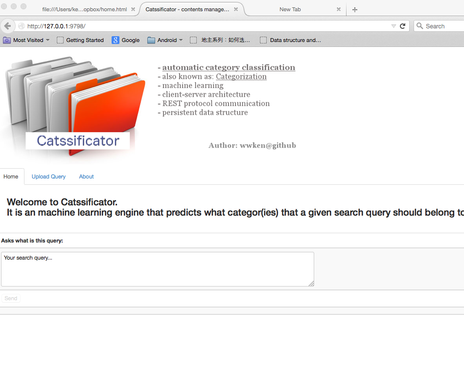

##About Category-Classificator (a.k.a. Catssificator)

#Offical release is coming soon .. Please stay tune!

http://www.catssifi.org/

###Supported platforms/environments
As of today, this software has been developed/tested in Mac/Linux platform and the fully-supported web-browser is FireFox (For chrome, i suppose it should be 100% fully compatible as well).  The <b>python 2.7x</b> is required to be installed. 

###How to install
Please run the following command:
<pre>
$ sudo ./install.sh
</pre>

It will automatically install all required <a href=doc/dependencies.md target=_blank>dependencies</a> into your local machine.  

###How to run
First run the A.I. server as (and let it run in the background and do not stop it):
<pre>
$ ./start_server.sh
</pre>

Then, there are basically two ways to interact with the A.I. server, 

####1) Browser mode:

Open a browser and enter: http://127.0.0.1:8080/ in the address bar and you will be brought to the contents management console page as follow:

You can ask any query or upload your queries to the A.I. server.  More information can be referred to <a href="doc/web.md" target="_blank">here</a>.

####2) Terminal mode:
Open an another terminal, run an inquire query, say "Android cell phone latest price" as:
<pre>
$ <b>./query.sh "Android cell phone latest price"</b>
Unfortunately, no category was found under the search query:Android cell phone latest price ...Please pick a category it should belong to:
1    Advertising                   2    Agriculture                   3    Art
4    Automotive                    5    Banking                       6    Berverages
7    Business                      8    Economics                     9    Education
10   Fashion                       11   Hardware                      12   Mobile_Devices
13   Robotics                      14   Science                       15   Social_Media
16   Sports                        17   Technology                    18   Television
19   Travel                        20   Weather
Please enter a category number: <b>12</b>
THANKS.  It has been recorded.
$
</pre>
Notice that when you issue an inquiry to the system and, if the system does not have any previous knowledge about it, it will ask you what category it should belong to.  So in the above example, since it is the first time you ask the system about 'Android phone price', it has no previous knowledge about it and then it will prompt you for the category.  Therefore, replying as 12 (Mobile_Devices) and the system will remember this (internally it will be stored in the file system for future analysis).  Next time let say you inquire something related to Android or phone, it will be able to figure out it should belong to Mobile Devices category, as followed:

<pre>
$ ./query.sh "where to buy phone"
Mobile_Devices
</pre>

The system is configured with 6000 categories.  you can always change it at config/category.txt 

#####Advanced capabilities
There are also advanced capabilities, as of today, <a href="doc/usage.md#words-stemming" target=_blank>words stemming</a>, included in the system.  Please refer to the <a href="doc/usage.md" target=_blank>useage document</a> for more information.

####(Optional) Pre-populate some data into the system  
I have prepared also a script that populated some search queries with its pre-defined category.  Run it to load it to the system so that when the server runs it have some data to play with:
<pre>
$ ./script/populate-knowledge.sh
$ ./script/populate-ai-database.sh
</pre>
Note that inside the above scripts the environment variable: CLASSIFICATOR_HOME must be set accordingly.
After that, if we ask something like, "drink tonight", it should automatically figure out it is a Berverages category
<pre>
$ ./query.sh "drink tonight"
Beverages
</pre>

###Testings - for developors only
#####Travis-ci build status:
This version of Catssificator has been tested using Python series 2.6 and 2.7. Builds are checked with <a href="https://travis-ci.org/wwken/category-classificator" target="_blank">travis</a>: 

#####Run the unit-tests locally:
In the src/test/ folder, there are various test cases that make sure the program won't break easily.  To run all test cases, do:
<pre>
$ scripts/unit-tests/run-all-unit-tests.sh
</pre>
Notice that Nose (https://nose.readthedocs.org/en/latest/) , is needed in order to run the tests.  Please install it beforehand.

###Algorithms - How I appoarch it
I will describe it later

